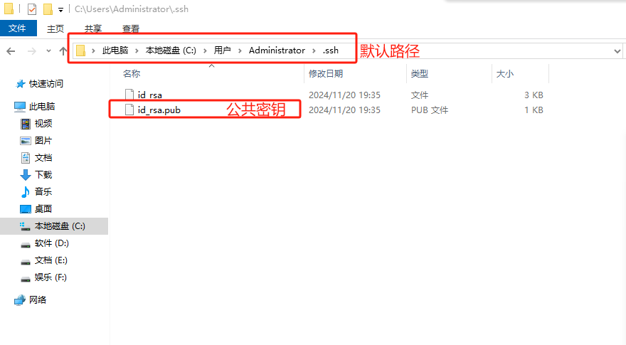
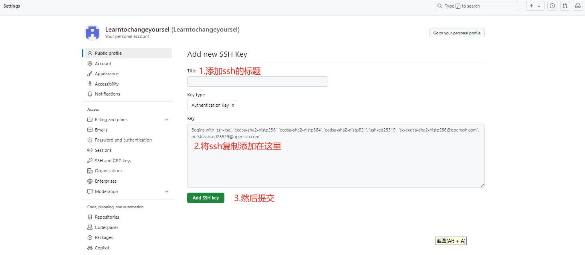

## 前端学习——day001
> ### git的安装与GitHub ssh配置
>
1.配置自己的用户名
````git
git config --global user.name "user name"
````
2.配置自己的邮箱
```` git 
git config --global user.email "pengsijiaiao@163.com"
````
3.查看自己是否配置成功
```` git
git config --global --list
````
4.生成ssh
````git 
ssh-keygen -t rsa
````
**生成ssh后，系统提示输入密码等三个选项直接跳过，不然以后每次远程控制都会输入账号密码**

5.github上添加ssh
 <!-- 此路径表示图片和MD文件，处于同一目录 -->
 <!-- 此路径表示图片和MD文件，处于同一目录 -->

> ### git常用命令

````git 
git init                                //初始化GitHub仓库
git add README.md                       //添加资源文件
git commit -m "first commit"            //对提交的缓存文件进行描述
git branch -M main                      //创建提交的分支
git remote add origin <ssh地址>          //选择仓库提交的地址
git push -u origin main                 //远程仓库与本地仓库同步
git clone <ssh地址>                      //克隆远程仓库
````
